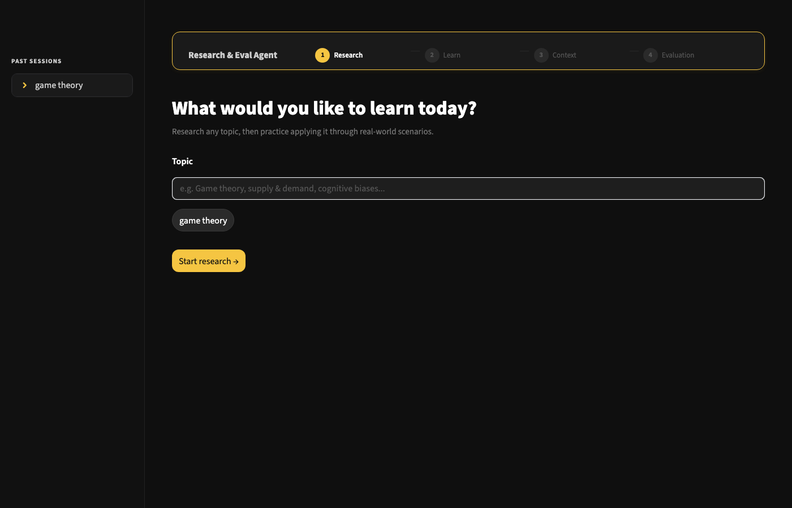
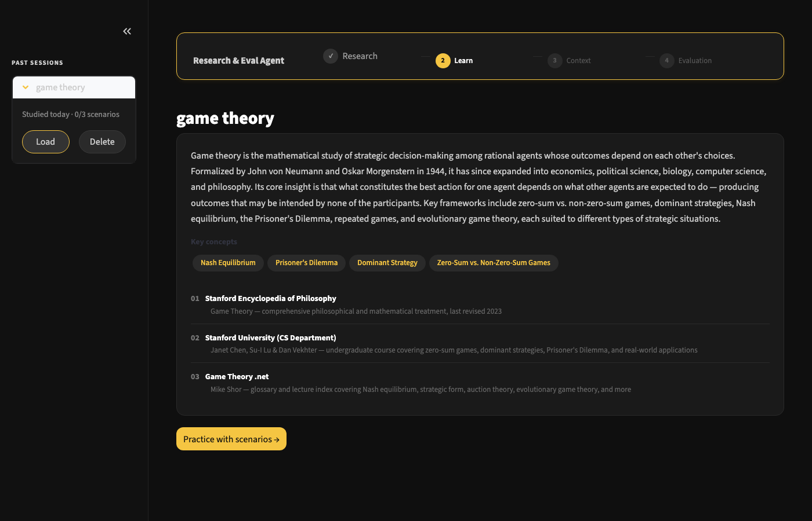
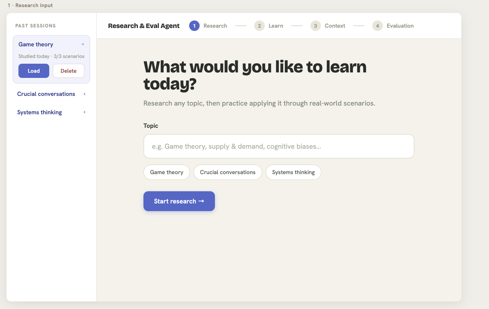
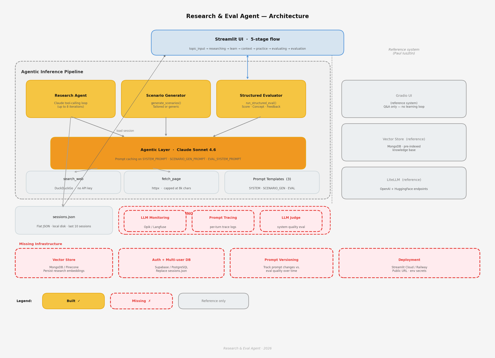

# Research and Eval Agent

An agentic AI tool that researches any topic via live web search, synthesises a cited report,
and is being extended toward scenario-based practice — evaluating your responses against the
specific principles found in research, not generic AI feedback.

Live Demo: coming soon (deploy to Streamlit Cloud) · Built with Claude + Streamlit

## Screenshots

| Topic input | Research report |
|---|---|
|  |  |

<details>
<summary>Design prototype (early layout reference)</summary>



</details>

## Current state

| Feature | Status |
|---|---|
| Web research → cited report | ✅ Working |
| Token usage + cost display | ✅ Working |
| Session saving (JSON) | ✅ Saves after every run |
| Sidebar: past session titles | ✅ Shows last 10 |
| Load / resume a past session | ✅ Load button restores full session state |
| Scenario-based eval loop (in-app) | ✅ Full 5-stage UI: research → context → practice → eval |

## What it does

1. **Research** — searches the web for a topic, synthesises a cited summary with frameworks and context
2. **Practice** — presents scenarios that test specific principles through application (not recall); optionally tailored to your real context
3. **Evaluate** — scores your response against principles found in research, not generic feedback; evaluation is structured and cites back to named concepts


## Why I built this

Most learning fails silently. You read a framework, nod along, and feel like 
you understand it - the gap between them only shows up when you're forced to actually use 
what you learned, under real conditions


This project exists to close that gap deliberately.

Research with the agent → Practice through real scenarios → 
Improve through evaluated revision → Articulate & Present


## Architecture



| Component | Role |
|---|---|
| **Model** | Claude Sonnet 4.6 — reasoning, research synthesis, evaluation |
| **Tools** | `search_web` (DuckDuckGo, no API key), `fetch_page` (HTML to clean text, capped at 8k chars) |
| **System Prompt** | Defines the research → scenario → evaluate sequence |
| **State** | `ResearchSession` schema, persisted to `state/sessions.json` |
| **UI** | Streamlit — replaces raw terminal output with a readable interface |

The agent loop runs Claude Sonnet 4.6 with tool use. Claude calls `search_web` and `fetch_page`
iteratively (up to 8 iterations), then writes the final report when it has enough sources.
The system prompt is prompt-cached, so repeated runs cost ~10% of the first call for the system context.


Full design rationale in [docs/spec.md](docs/spec.md).

## Engineering decisions worth noting


- Prompt caching — system prompt + tool schemas are cached, cutting repeated input costs by 90%
- Iteration safety cap — prevents runaway tool-calling loops; if hit,
forces a synthesis from partial research instead of failing outright
- Cost transparency — real token usage and estimated cost shown after
every run, in both terminal and UI
- Validated manually before coding — the core research, scenario, evaluate
loop was tested by hand in conversation before any code was written

## Setup

**1. Clone and enter the project**
```bash
git clone <your-repo-url>
cd "Research and Eval Agent"
```

**2. Create and activate a virtual environment**
```bash
python3 -m venv .venv
source .venv/bin/activate
```

**3. Install dependencies**
```bash
pip install -r config/requirements.txt
```

**4. Add your Anthropic API key**
```bash
cp config/.env.example config/.env
# then edit config/.env and add your key:
# ANTHROPIC_API_KEY=sk-ant-...
```

**5. Run the app**
```bash
streamlit run app.py
```

The app opens at `http://localhost:8501`.

## Cost

Each research run uses Claude Sonnet 4.6 (`$3 / MTok` input, `$15 / MTok` output).
A typical run costs **$0.01–$0.05** depending on topic depth. The system prompt is prompt-cached
after the first iteration of each run, reducing repeated input token costs by 90%.
The UI displays exact token counts and an estimated cost after every run.

## Roadmap

- [x] **Scenario eval loop in UI** — full 5-stage flow with in-app response input and structured evaluation
- [x] **Load past sessions** — sidebar Load button restores the full session including report and scenario progress
- [ ] **Revise and re-evaluate** — let the user revise their response and get re-scored before advancing
- [ ] **Persistent memory across sessions** — carry prior research context forward
- [ ] **Notion MCP integration** — push sessions to Notion for longer-term reference
- [ ] **Multi-topic comparison view**

## Known limitations

- Revise-and-resubmit loop is not yet built — users advance after one evaluation attempt
- Web search quality varies — some sources restate primary content rather than providing independent evidence; the agent flags this where detectable
- Single topic per run; no cross-topic comparison yet

## Entry points

| File | Purpose |
|---|---|
| `app.py` | Streamlit UI — recommended way to run |
| `main.py` | Terminal-only runner — useful for quick tests without the UI |

## Tech stack

Python, Anthropic API (Claude Sonnet 4.6), Streamlit, DuckDuckGo Search, httpx
